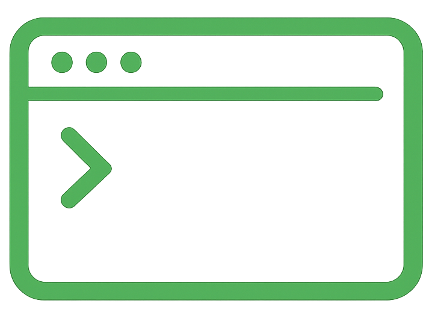

<div align="center">
  

  <h1>my-node-cli</h1>

  <p><strong>Learn how to build beautiful Node.js CLIs</strong></p>

  <p>
    <a href="https://github.com/gomzkov/my-node-cli/blob/main/LICENSE"></a>
    <a href="https://nodejs.org"></a>
  </p>

  <p>
    <a href="#examples">Examples</a> •
    <a href="#installation">Installation</a> •
    <a href="#libraries">Libraries</a> •
    <a href="https://gomzkov.medium.com/">Blog Post</a>
  </p>

</div>

<br>

A hands-on example project demonstrating how to create interactive command-line interfaces with Node.js. Companion repo for the Medium article [Building a CLI with Node.js in 2024](https://gomzkov.medium.com/).

<div align="center">
  
</div>

## Examples

This project includes interactive examples for popular CLI libraries:

| Example | Library | What it demonstrates |
|---------|---------|---------------------|
| Basic Example | Node.js | Simple console output |
| Chalk Example | [chalk](https://github.com/chalk/chalk) | Colored terminal output |
| Figlet Example | [figlet](https://github.com/patorjk/figlet.js) | ASCII art text banners |
| Inquirer Example | [inquirer](https://github.com/SBoudrias/Inquirer.js) | Interactive text prompts |
| Inquirer Confirm | [inquirer](https://github.com/SBoudrias/Inquirer.js) | Yes/no confirmation prompts |
| Inquirer List | [inquirer](https://github.com/SBoudrias/Inquirer.js) | Selection list prompts |
| Ora Example | [ora](https://github.com/sindresorhus/ora) | Terminal spinners |

## Installation

```bash
# Clone the repository
git clone https://github.com/gomzkov/my-node-cli.git

# Navigate to project
cd my-node-cli

# Install dependencies
npm install

# Link globally (optional)
npm link
```

## Usage

Run the CLI to see all examples:

```bash
# If linked globally
my-node-cli

# Or run directly
npm start
```

Select an example from the interactive menu to see it in action.

## Libraries

This project demonstrates these essential CLI libraries:

- **[Commander](https://github.com/tj/commander.js)** — CLI framework with commands and options
- **[Chalk](https://github.com/chalk/chalk)** — Terminal string styling
- **[Figlet](https://github.com/patorjk/figlet.js)** — ASCII art text generation
- **[Inquirer](https://github.com/SBoudrias/Inquirer.js)** — Interactive command line prompts
- **[Ora](https://github.com/sindresorhus/ora)** — Elegant terminal spinners

## Project Structure

```
my-node-cli/
├── bin/
│   └── index.js          # CLI entry point
├── src/
│   └── commands/         # Example implementations
│       ├── basic-example.js
│       ├── chalk-example.js
│       ├── figlet-example.js
│       ├── inquirer-example.js
│       ├── inquirer-confirm-example.js
│       ├── inquirer-list-example.js
│       └── ora-example.js
├── package.json
└── README.md
```

## Learn More

Read the full tutorial on Medium: [Building a CLI with Node.js in 2024](https://gomzkov.medium.com/)

## License

MIT
